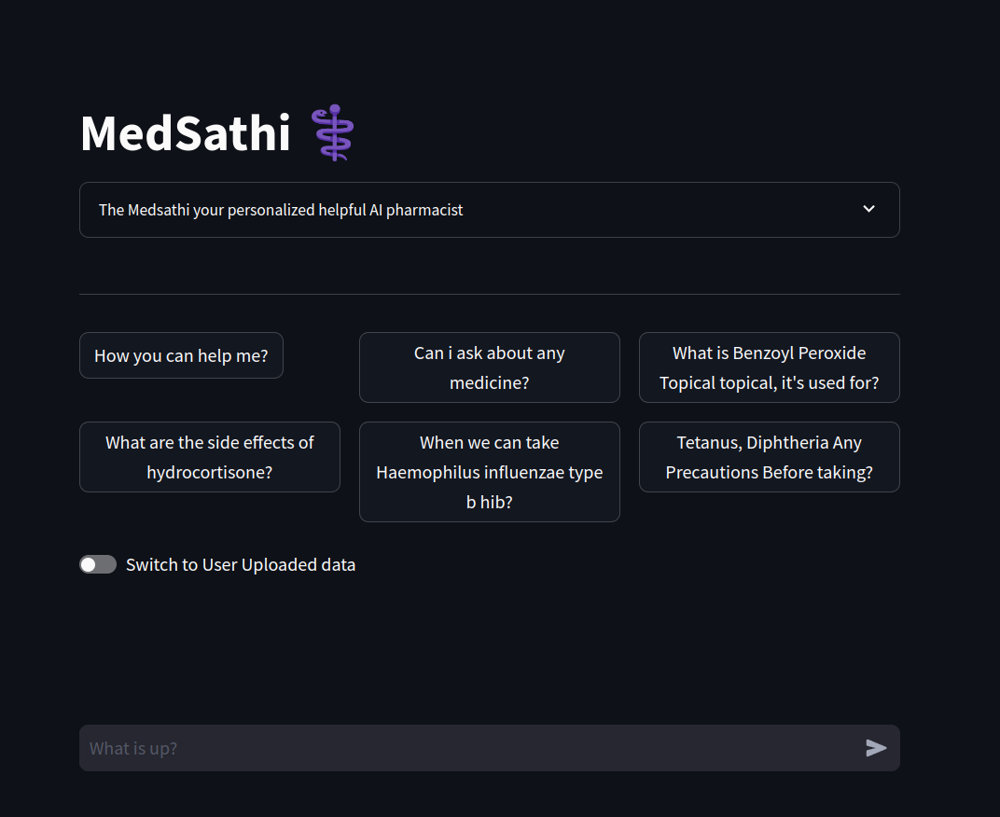
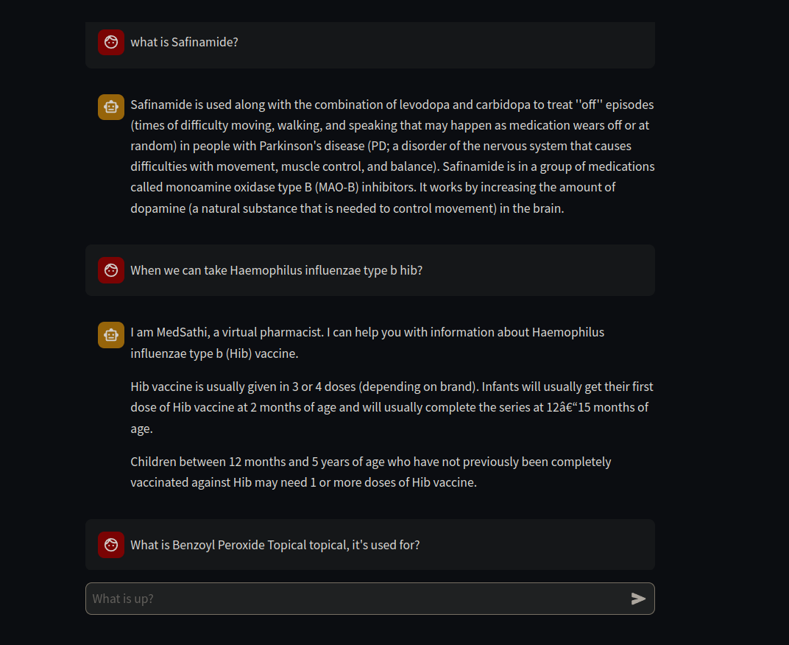

# Code4Cause Project ([view](https://medsmart.streamlit.app/))

## Problem Statement
**Vertical: Medical/Healthcare**

Many individuals face various challenges when dealing with their prescription medications. These challenges include unfamiliar medical terminology, misinterpreted prescriptions, unclear dosage and usage instructions, missed expiration dates, unexpected side effects, and drug interactions. These issues can lead to overdosing, accidents, and even death.

## Proposed Solution
This project aims to leverage machine learning and generative AI to help address some of the challenges that patients and doctors face with medical prescriptions. This will involve the four features outlined below:

1. **Medicine Scanner:** Scans medicine to inform about the medicine, dosage, side effects, and date of expiry.
2. **Medical Report Scanner:** Scans and simplifies test reports to help patients understand their medical reports.
3. **Prescription Scanner:** Scans and interprets handwritten prescriptions to help patients, pharmacists, and others properly interpret a doctor’s instructions.
4. **Prescription Generator:** Enables doctors to more quickly and easily generate accurate, understandable prescriptions.

## Detailed Explanation
### Data Extraction and Transformation
- **Data Sources:** Medical data from UCIML repositories, Kaggle, and other trusted sources.
- **Data Processing:** Feature engineering and data cleaning will be performed after extraction.
- **Data Storage:** Data will be converted to embeddings and stored in a vector database for Retrieval-Augmented Generation (RAG).

### Retrieval-Augmented Generation (RAG)
- **Model Utilization:** Leverage open-source Large Language Models (LLMs) to power RAG.
- **Model Fine-tuning:** Fine-tune the model for the medication use case.

### User Interface and LLMOps
- **User Interface:** Create a user-friendly interface.
- **LLMOps Pipeline:** Define an end-to-end LLMOps pipeline to enable additional training and fine-tuning.

## User Friendly Interface


## Ask About your Medicines



This project encompasses GenAI, MLOps, and LLMOps tech stacks.

## How to Setup the Project
1. **Clone the Repository:**
   ```bash
   git clone https://github.com/yourusername/analytics-edge-ecosystem.git
   cd analytics-edge-ecosystem

## Set API keys
2. **Setting all required API keys**
- **Create a .env file**
```
HUGGINGFACEHUB_API_TOKEN="API key"
PINECONE_API_KEY = "API key"
PINECONE_INDEX = "medcial-rag-chatbot"
GENAI_API_KEY = "Gemini key"
GROQ_API_KEY = "Lama3-7b"
```
### Add your APi keys

## Create Virtual Environment
3. **Install all the required packages**
```
pip install -r requirements.txt
```

## Run Command
4. **Run app.py**
```
steamlit run app.py
```


## Acknowledgments
- Thanks to the open-source community for providing various tools and frameworks.
- Special thanks to UCIML, FDA, and other trusted sources for providing the datasets.

## Future Work
The project aims to continually improve and expand its features. Future work includes:
- **Enhanced Model Training:** Continuously improve the accuracy and efficiency of AI/ML models.
- **Integration with More Data Sources:** Expand the data sources to include more comprehensive and diverse medical data.
- **User Feedback Mechanism:** Implement a feedback system for users to report issues and suggest improvements.
- **Mobile Application:** Develop a mobile application to make the solution more accessible to patients and healthcare providers.

## Data Sources
- [Government medical data source](https://medlineplus.gov)
- [Advance medical data Gov source](https://www.nlm.nih.gov/databases) -> Licensed required
- [Medical Encyclopedia](https://medlineplus.gov/encyclopedia.html)
- [Journal lists](https://www.ncbi.nlm.nih.gov/pmc/journals/)


### [Steps]
- Initial project setup
- Implementation of Medicine Scanner, Medical Report Scanner, Prescription Scanner, and Prescription Generator
- Deployment on Kubernetes using Rancher and K3s
- Development of LLMOps pipelines

## Support
If you need support, please open an issue

---

This README file provides a comprehensive overview of the project, including setup instructions, contribution guidelines, license information, acknowledgments, future work, references, FAQs, code of conduct, changelog, and support details. Make sure to update the placeholders with actual information and links specific to your project.
"# MedSmart" 
